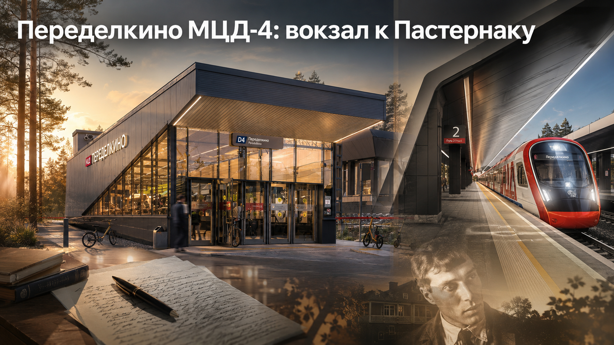
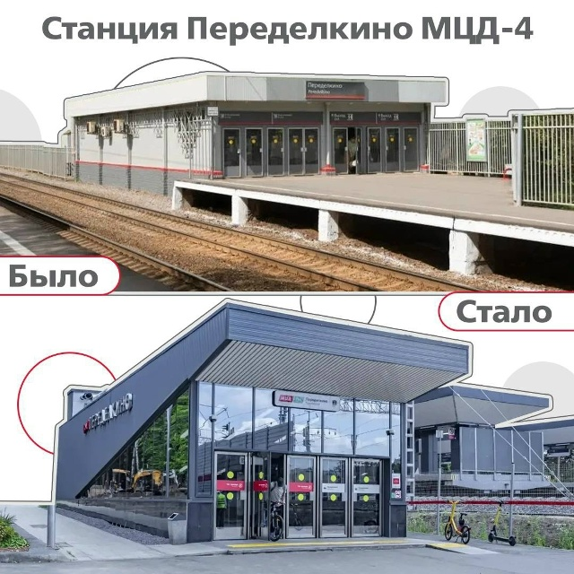
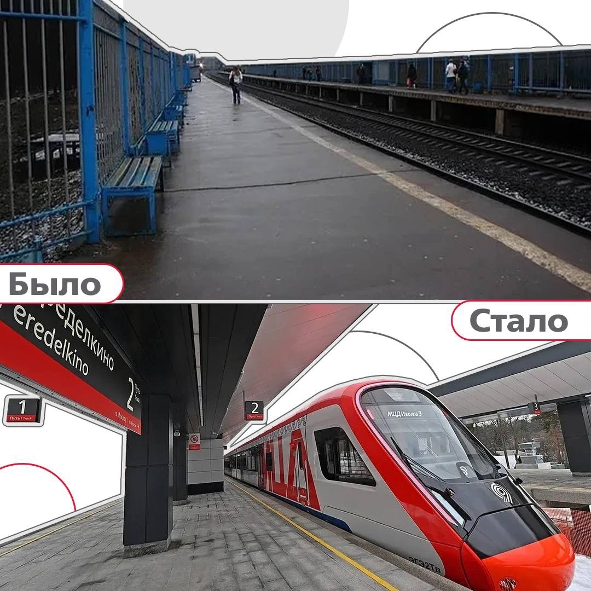

# Переделкино МЦД‑4: как старая платформа стала вокзалом к Пастернаку — и почему это больше, чем реконструкция

Старое Переделкино я узнаю без подписи.

Открытая платформа. Синие ограждения. Сквозняк в лицо. И старое железнодорожное правило: приехал — вышел — дальше разбирайся сам. Пассажиру с коляской оставалось искать помощь. Пожилому человеку — заранее оценивать лестницы и собственные силы. Если маршрут оказывался слишком тяжёлым, железная дорога ничего не объясняла. Она просто не принимала тебя в расчёт.

Москвичи ездили так годами. Привыкли. Даже перестали замечать.

Пока Москва не решила, что для МЦД такая «норма» больше не годится.

Инфографика **«Было — стало»** здесь работает почти как приговор старой логике. Сверху — пригородная остановка, обслуживавшая поезд. Снизу — городской вокзал, который должен обслуживать человека. Разница не сводится к стеклу, металлу и новым навесам. Пассажир перестал быть приложением к расписанию.

Если говорить языком механики, траекторию определяет не одна скорость. Важны начальные и граничные условия. Можно пустить частые поезда, ввести единую оплату и протянуть диаметр через всю Москву. Но если человек не может нормально попасть на платформу, система остаётся незавершённой. Переделкино перестраивали именно на этом уровне.

*Верхний кадр — прежний наземный павильон. Нижний — новый вход в городской вокзал Переделкино. За сменой архитектуры скрывается смена отношения к пассажиру.*

## Было: привычная неудобность, которую перестали замечать

На старом снимке нет разрухи. И в этом его сила. Небольшой павильон, открытый перрон, несколько лавок, ограждения вдоль путей. Всё работало. Электрички останавливались. Люди уезжали и возвращались.

Только городской транспорт нельзя оценивать по принципу «поезд ведь пришёл». Станция начинается раньше дверей вагона — с подхода, перехода через железную дорогу, навигации и возможности добраться до нужной платформы без чужой помощи.

До реконструкции этих возможностей не хватало. Пассажир с детской коляской зависел от лестниц и доброй воли окружающих. Человеку с ограниченной подвижностью приходилось заранее продумывать, сможет ли он вообще воспользоваться станцией. Тяжёлая сумка превращала обычный переход в отдельную физическую работу.

Не авария. Не громкая драма. Хуже — ежедневная, въевшаяся неудобность, которую все считали неизбежной.

Именно такие места особенно трудно менять. Город возмущается большой поломкой. К маленькому унижению он привыкает.

## Стало: станция Переделкино после реконструкции

На месте прежнего остановочного пункта появился городской вокзал общей площадью **6,4 тысячи квадратных метров**. Построили **две новые платформы** с навесами на всю длину. Под железнодорожными путями разместили пассажирский вестибюль площадью **2,3 тысячи квадратных метров**.

Внутри работают кассы и турникеты, оборудованы санитарные комнаты. Для вертикальной связи установили **4 эскалатора** и **3 лифта**. Они сделали станцию доступнее для маломобильных пассажиров.

Цифры выглядят сухо, пока не переведёшь их на человеческий язык.

Три лифта — это не три единицы оборудования. Это возможность проехать весь маршрут самостоятельно. Четыре эскалатора — не строка в строительном отчёте. Это отменённый подъём с тяжёлой сумкой. Подземный вестибюль — не просто 2,3 тысячи квадратных метров бетона и отделки. Это переход под путями без риска и суеты.

Вот где проходит настоящая граница между старой платформой и городским вокзалом.

Обновлённое Переделкино открыли **26 декабря 2022 года**. Сам **МЦД‑4 запустили 9 сентября 2023 года**. Сначала станция получила новое тело, затем вошла в новую транспортную систему Москвы.

## Стройка без остановки движения: железнодорожная хирургия

В исходной справке есть фраза, которую легко прочитать и тут же забыть: работы велись **без остановки движения поездов**.

А забывать её нельзя.

Железную дорогу невозможно выключить на несколько месяцев, как закрытый на ремонт магазин. Люди продолжают ездить на работу и учёбу, возвращаются домой, пересаживаются на другие линии. Поезда обязаны идти по графику, пока рядом разбирают старые конструкции и возводят новые.

Пассажиры пользовались временной инфраструктурой. Временными были проходы, решения и ежедневная логистика станции. Постоянным оставалось движение.

Так выглядит настоящая инженерная работа: оперировать работающий организм, не останавливая сердцебиение. Большинство пассажиров не обязано знать, сколько технологических окон, согласований и последовательных переключений стоит за таким результатом. Но это важно видеть.

Новая станция ценна не только тем, что построили. Важен способ: город улучшил узел, не лишив район железнодорожного сообщения.

## Подземный вестибюль важнее эффектного фасада

На первой инфографике взгляд сразу цепляется за новый павильон. Острый силуэт, стеклянный фасад, тёмная облицовка. Современно. Фотогенично. Хорошо заметно в ленте.

Но инженерная суть Переделкина спрятана ниже уровня земли.

Железная дорога разрезает территорию жёстче обычной улицы. Цена неправильного решения здесь выше. Подземный вестибюль связал стороны путей и вывел пассажиров к платформам без пересечения железной дороги по поверхности. Потоки получили понятную геометрию: вход, распределение, подъём на нужную платформу.

Красивый фасад формирует первое впечатление. Подземный вестибюль спасает время, силы и, в предельной ситуации, жизнь.

Старая платформа обслуживала поезд. Новый вокзал обслуживает человека.

*Сверху — открытый перрон старого Переделкина. Снизу — высокая платформа, навес, навигация и поезд МЦД. На фотографии видна архитектура. Безопасность и исчезнувшее бытовое напряжение в кадр не помещаются.*

## МЦД‑4: почему местная станция стала частью большого города

Четвёртый Московский центральный диаметр протянулся на **86 километров** — от Апрелевки до микрорайона Железнодорожный в Балашихе. При запуске на линии работали **36 станций**. МЦД‑4 связал Киевское и Горьковское направления сквозным маршрутом через Москву.

Раньше западные пригородные станции воспринимались прежде всего как дорога к Киевскому вокзалу. Диаметр изменил геометрию поездки. Пассажир получил сквозное движение, пересадки на метро и МЦК, единую городскую тарифную логику.

Электрички МЦД курсируют примерно **с 05:30 до 01:00**, а интервалы в часы пик составляют **5–7 минут**. Для Переделкина выигрыш измеряется не только минутами. Станция перестала быть платформой «для своих» и вошла в общий ритм столицы.

Чем выше интенсивность движения, тем строже требования к узлу. Частый поезд бессмысленен, если до него тяжело добраться. Удобный вагон не исправит опасный переход. МЦД работает как система лишь тогда, когда модернизированы не только рельсы и составы, но и путь пассажира от городской улицы до двери поезда.

Переделкино этот экзамен сдало.

## Как добраться до Переделкина сейчас — и что изменил МЦД‑4

Запрос «как добраться до Переделкина» давно означает больше, чем поездку в жилой район. Сюда едут к писательскому городку, музеям и дачам, связанным с русской литературой XX века.

Сегодня железнодорожная станция Переделкино включена в МЦД‑4. Для пассажира это означает сквозной маршрут через Москву, удобные пересадки и городской режим работы диаметра. Уже на самой станции путь стал понятнее: подземный вестибюль разводит потоки, лифты и эскалаторы связывают уровни, навесы защищают платформы.

МЦД не переносит дачу Пастернака к дверям вагона. Но он убирает транспортный квест из начала путешествия. А это важная разница. Культурное место начинается не у музейной кассы. Оно начинается с дороги к нему.

## Переделкино: станция у одного из нервных центров русской литературы

Название «Переделкино» весит больше обычной надписи на платформе.

Причём легенда начиналась совсем не с безупречных дач среди сосен. Первые жители жаловались на воду в подвалах, дыры в стенах и плесень. Дома приходилось доделывать своими силами. Переделкинская мифология выросла не из архитектурного комфорта, а вопреки ему.

Городок писателей начал складываться в **1930‑е годы**. После постановления о его строительстве первые дачи возвели в **1936 году**. Среди их жителей были Борис Пастернак, Исаак Бабель и другие известные литераторы. Позже с Переделкином связали свои судьбы Корней Чуковский, Константин Паустовский, Булат Окуджава, Белла Ахмадулина, Евгений Евтушенко.

Потом пришли 1937 год и репрессии. Исаак Бабель, Борис Пильняк и другие первые жители стали жертвами террора. Их дачи превратились в «последние адреса». Даже приветствие соседу через забор могло выглядеть политическим жестом.

Вот почему Переделкино нельзя превращать в сладкую открытку с сиренью и верандой. Здесь русская литература жила рядом со страхом.

## «Жди меня», пять шишек и картошка Пастернака

Историю Переделкина лучше всего удерживают не списки фамилий, а детали.

В июле **1941 года** Константин Симонов на даче Льва Кассиля написал **«Жди меня»** — стихотворение, ставшее для миллионов почти личным письмом с фронта. В годы войны на участках рыли траншеи, размещали военные подразделения и зенитные средства. Переделкинская тишина тогда слушала гул самолётов.

После войны многие дачи были разорены. Доски с заборов уходили на растопку. Иногда топливом становились книги. Пастернак сажал картошку: огород помогал выжить в годы опалы и скудных гонораров. Здесь он работал над **«Доктором Живаго»**.

В **1955 году** Корней Чуковский устроил первый детский костёр «Здравствуй, лето!». Вход стоил **пять шишек**. Не рублей. Не билетов. Пять обычных сосновых шишек — пропуск в детское Переделкино, где выступали писатели и артисты.

Булат Окуджава получил здесь дачу в **1987 году**. В Переделкине он писал поздние стихи и работал над романом **«Упразднённый театр»**.

Попробуйте после этого назвать станцию обычным остановочным пунктом.

## Не превращаем ли мы литературную Мекку в красивую пересадку?

Новый вокзал сделал Переделкино доступнее. Он улучшил транспортное обслуживание района **Ново‑Переделкино** и поселения **Внуковское**, а путь к писательскому городку стал удобнее.

Но удобство тоже ставит вопрос.

Не растворится ли Переделкино в потоке быстрых посетителей? Не станет ли поездка короткой процедурой: выйти из МЦД, сделать несколько кадров, отметить геолокацию и уехать? Не превратим ли мы место, где писались книги и решались человеческие судьбы, в красивый фон?

Ответ не может быть сладким и удобным.

Плохая транспортная доступность не охраняет культуру. Она закрывает её от большинства. Музей, до которого тяжело добраться без автомобиля и физических усилий, постепенно становится территорией посвящённых. А Переделкино не должно принадлежать узкому клубу. Это часть русской истории.

Лифт не объяснит Пастернака. Эскалатор не научит читать Чуковского. Навес не передаст, как в июле 1941 года звучало «Жди меня».

Но транспорт убирает барьер. Дальше всё зависит от человека.

## Что доказывают фотографии «было — стало»

Первая инфографика показывает вход. В верхнем кадре станция ещё живёт по логике пригородной остановки: небольшой павильон, простой выход к платформе, минимум пространства. В нижнем — полноценный городской вход, который не стыдно назвать вокзалом.

Вторая инфографика сильнее. Сверху — длинный открытый перрон, лавки у синего ограждения, мокрый асфальт. Снизу — широкий навес, высокая платформа, крупная навигация и красно-белый поезд МЦД.

Но доказательство скрыто не только в том, что видно.

На фотографии нельзя показать, как пассажир перестал заранее бояться лестницы. Нельзя снять исчезнувший вопрос: «Кто поможет поднять коляску?» Не попадает в кадр безопасность перехода под путями. Не видна самостоятельность человека на кресле-коляске.

Хорошая транспортная система часто проявляется отсутствием событий. Никто не мечется. Никто не перебегает пути. Никто не остаётся на неправильной стороне. Поезд приходит, двери открываются, город продолжается.

## Победа над старым правилом: «сам приспособишься»

Переделкино показало правильный масштаб московской работы. Здесь не строили дворец ради эффектной картинки. Здесь убрали унизительную неудобность и создали нормальный городской узел.

Скажу прямо: это победа.

Победа над старой пригородной логикой: сам найдёшь переход, сам поднимешься, сам приспособишься. Москва перестала относиться к пассажиру как к человеку, обязанному терпеть железную дорогу. Теперь железная дорога приспосабливается к человеку.

Это и есть развитие транспорта — не фанфары, не рекорд ради отчёта, не эффектный рендер. Мать с коляской не ищет случайного помощника. Пожилой пассажир не считает ступени. Маломобильный человек получает маршрут, а не обещание доступности.

Новый вокзал Переделкино сделал путь безопаснее, понятнее и достойнее. Это нужно было сделать.

Но главный вопрос уже не к строителям.

Мы приблизили Переделкино транспортно. Стали ли мы ближе к нему человечески? К Переделкину Пастернака, Симонова, Чуковского, Окуджавы. К месту, где соседствуют детский костёр за пять шишек, картофельная грядка опального поэта, траншеи военного времени и рукопись «Доктора Живаго».

Или теперь это просто красивая станция МЦД‑4, через которую удобно пройти, быстро сделать фотографию и уехать дальше?

Или мы просто сделали удобную пересадку рядом с легендой?

**Как считаете вы: современный вокзал дал литературному Переделкину вторую жизнь — или городской поток уже начинает теснить его тишину? Пишите прямо. Здесь нужен настоящий спор: живой, московский, по делу.**

---

## Источники

- [Исходная справка: «Станция Переделкино МЦД‑4: из каменных джунглей — в мир литературы»](platform_p.md)
- [Открытие городского вокзала Переделкино после реконструкции — портал Мэра и Правительства Москвы](https://www.mos.ru/mayor/themes/8829050/)
- [Реконструкция станции Переделкино будущего МЦД‑4 — Стройкомплекс Москвы](https://stroi.mos.ru/news/stantsiia-pieriedielkino-poslie-riekonstruktsii-voidiet-v-sostav-mtsd-4)
- [МЦД‑4 в цифрах — Московский метрополитен](https://mcd.mosmetro.ru/mcd-4/)
- [Общественный транспорт Москвы: режим работы и интервалы МЦД](https://www.mos.ru/otvet-transport/vse-ob-obschestvennom-transporte-v-moskve/)
- [История городка писателей — Дом творчества Переделкино](https://pro-peredelkino.org/gorodok-pisateley)
